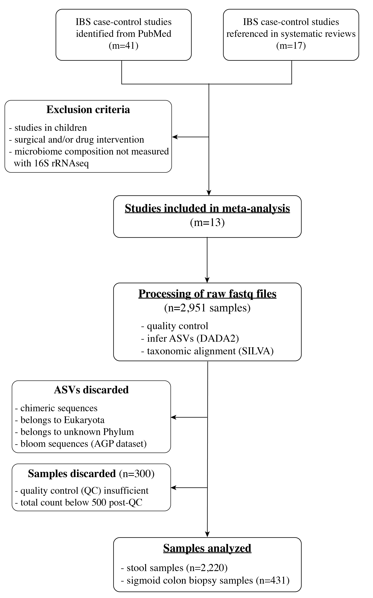

# Meta-analysis of microbiome composition measured by 16S rRNA seq in IBS case-control studies

This is the repository for the study MetaIBS - large-scale amplicon-based meta analysis of irritable bowel syndrome (ADD PAPER LINK).
This repository contains all the data and code used for the meta-analysis, and can also be used as a template to extend this meta-analysis with your own data!

	

<u>Table of contents</u>:
- [Meta-analysis overview](https://github.com/bio-datascience/MetaIBS#meta-analysis-overview)
- [Structure of this repository](https://github.com/bio-datascience/MetaIBS#structure-of-the-repository)
- [Requirements](https://github.com/bio-datascience/MetaIBS#requirements)
- [How to use this repository](https://github.com/bio-datascience/MetaIBS#how-to-use-this-repository)
	- [Reproduce figures from the paper](https://github.com/bio-datascience/MetaIBS#reproduce-figures-from-the-paper)
	- [Extend meta-analysis by adding your own datasets](https://github.com/bio-datascience/MetaIBS#extend-the-meta-analysis-by-adding-your-own-datasets)

 

## Meta-analysis overview
For the sake of this study, we included 13 datasets, as summarized in this flowchart:

	

 

## Structure of the repository
- [data/](data/): `data` directory containing preprocessed data (phyloseq objects, count tables aggregated at different taxonomic levels, differential abundance tables, ...). You will find there the data generated by Salomé Carcy, Johannes Ostner and Viet Tran, that you can use directly to extend this meta-analysis with your own datasets;
- [data_empty/](data_empty/): empty `data` directory for users who would like to reproduce our results. It copies the directory structure of the [data/](data/) directory, containing only `README.md` files;
- [scripts/](scripts/): `code` directory containing R scripts for (1) preprocessing raw fastq files into phyloseq objects; and (2) performing analyses on combined data from different datasets

ADD REPO TREE

 

## Requirements
A few things are necessary for you to do before being able to use this repository:
- download the [data/](data/) directory from our Zenodo link (ADD ZENODO LINK), and put it here in the root directory;
- install [git LFS](https://git-lfs.com/) to be able to clone entirely this repository;
- install R ([version 4.1.3.](https://cran.r-project.org/bin/macosx/base/) was used for this project);
- install the required packages:
	- for R packages: create your R project & run `renv::restore()` in your console, and it will download all the packages necessary at the version used for MetaIBS;
	- for python packages: create a new python environment and install the packages in `requirements.txt` via pip: `pip install -r requirements.txt`

 

## How to use this repository
It depends what analysis you want to do :thinking:

### Reproduce figures from the paper
In that case, you can:
1. Start by downloading & preprocessing the raw data for each dataset: everything you need to know will be in the [scripts/analysis-individual/](scripts/analysis-individual/) directory;
2. Repeat the analyses performed on several datasets: everything is in the [scripts/analysis-combined](scripts/analysis-combined/) directory.

To note, you can go to step 2 without having to do step 1, using the data we generated that is saved in the [data/](data/) directory. Make sure to change file paths in the scripts (you can modify one file path at the top of each script) and export all of your outputs to the [data_empty/](data_empty/) directory!

### Extend the meta-analysis by adding your own datasets
In that case, you can:
1. Take a quick look at how raw fastq files were preprocessed for the datasets already included in this meta-analysis. You will want to look at the `01_Dada2-NameDataset.Rmd` files (or their HTML outputs) that are located in each subdirectory of [scripts/analysis-individual/](scripts/analysis-individual/). Even though there is one preprocessing script for each dataset, they are all mostly identical (little changes for the primer sequences, etc.), so you don't need to look at all the 13 scripts (for the 13 datasets);
2. Create a new directory within the [scripts/analysis-individual/](scripts/analysis-individual/) directory, to preprocess your own data. Save your phyloseq object into the [data/phyloseq-objects/](data/phyloseq-objects/) directory;
3. Go into the [scripts/analysis-combined/](scripts/analysis-combined/) directory, and you can re-run whichever analysis. Your phyloseq object should get automatically added, as we import automatically all the phyloseq objects present in the [data/phyloseq-objects/](data/phyloseq-objects/) directory. Or you can of course add your own scripts to run additional analyses! :upside_down_face: