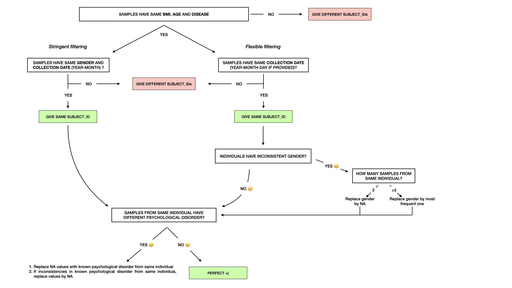

```{r, include=FALSE}
knitr::opts_chunk$set(warning=FALSE, message=FALSE,
                      root.dir = "~/Projects/IBS_Meta-analysis_16S/data/analysis-individual/Hugerth-2019/00_Metadata-Hugerth/")
```

##########
# IMPORT #
##########

## 1. Libraries
```{r import-libraries}
#install.packages("readxl")
library("readxl")
library(data.table)
library(tidyverse)
```

## 2. Data
```{r import-data}
path <- "~/Projects/IBS_Meta-analysis_16S"

# Metadata table downloaded from the SRA
sra_metadata <- read.csv(file.path(path, "data/analysis-individual/Hugerth-2019/HugerthSraRunTable.txt"), header=TRUE, sep = ",")
head(sra_metadata)

# Import the supplementary ASV table from the paper
paper_supp <- read_excel(file.path(path, "data/analysis-individual/Hugerth-2019/00_Metadata-Hugerth/Paper_Samples/ASV_table_PAPER.xlsx"))
head(paper_supp)

# Import the "suggested" runs from the paper (samples ERS3379832-ERS3380418)
paper_runs <- read.csv(file.path(path, "data/analysis-individual/Hugerth-2019/00_Metadata-Hugerth/paper_suggested.csv"), header=TRUE, sep = ",")
head(paper_runs)
```


##################
# CLEANUP TABLES #
##################

## 1. SRA metadata table

The SRA metadata table was downloaded from the SRA with the accession number PRJEB31817.

```{r sra-metadata}
########
# Keep only relevant columns
col <- c("Run", "Collection_Date", "environment_.biome.", "host_body_product", "Host_Age", "host_body.mass_index", "host_subject_ID", "sample_storage_duration", "sequencing_run", "Extraction_Plate", "host_disease_status", "host_sex", "gastrointestinal_tract_disorder")

# CLEANUP SRADF
sraDF <- sra_metadata %>%
  select(col) %>%
  # remove 26 "bioreactor" samples (controls)
  filter(environment_.biome. != "bioreactor") %>% 
  select(-environment_.biome.) %>%
  # rename columns
  rename_with(tolower) %>%
  rename(Run=run,
         sample_type=host_body_product,
         host_bmi=host_body.mass_index,
         host_ID=host_subject_id,
         host_psy=host_disease_status,
         host_disease=gastrointestinal_tract_disorder) %>%
  # rename sample_type
  mutate(sample_type=replace(sample_type, sample_type=="Mucosal tissue", "sigmoid"),
         sample_type=replace(sample_type, sample_type=="Faeces", "stool")) %>%
  # rename IBS & healthy in host_disease
  mutate(host_disease=gsub("IBS.*)", "IBS", host_disease),
         host_disease=replace(host_disease, host_disease=="none", "Healthy"))
  
head(sraDF)


#######
# Create a new dataframe with only ibs/hc samples
sraDF.ibs <- sraDF %>%
  filter(host_disease == "Healthy" | host_disease == "IBS")

table(sraDF.ibs$host_disease) # sanity check (hc 467 - ibs 140)
```

Even though the paper reported to have 95 IBS samples and 466 healthy samples (Table 2), on the SRA there is a different number of IBS/healthy samples... Let's try to figure out which samples were included in the paper.


## 2. Paper supplementary

The supplementary material with the ASV table of the authors was downloaded directly from the paper's website https://gut.bmj.com/content/69/6/1076

```{r paper-supplementary}
# Create dataframe with the sample names (found as column names in the ASV table)
paperDF <- data.frame("raw_names" = colnames(paper_supp)[2:562])
head(paperDF)
dim(paperDF) # there are 561 rows (as there are 561 samples in the paper)

# The sample names look like "X170429_27.547_0039_sigmoideum"
# Which corresponds to "sequencing run _ extraction plate _ subject ID _ sample type"

# We need to "split" the sample names
paperDF <- paperDF %>%
  separate(col=raw_names, into=c("sequencing_run", "Extraction_Plate", "host_subject_ID", "host_body_product"), sep="_", remove=FALSE) %>%
  # rename columns
  rename_with(tolower) %>%
  rename(host_ID=host_subject_id,
         sample_type=host_body_product) %>%
  # cleanup
  mutate(sequencing_run=gsub("X", "", sequencing_run),
         extraction_plate=gsub("[.]", "-", extraction_plate),
         host_ID=as.numeric(host_ID)) %>%
  # rename sample_type
  mutate(sample_type=replace(sample_type, sample_type=="sigmoideum", "sigmoid"),
         sample_type=replace(sample_type, sample_type=="feces", "stool"))
  
head(paperDF) 
```


Now let's assign host_disease of the samples included in the paper. We have information on the sample_type, extraction_plate, sequencing_run and individual ID, which should be enough to identify the samples in the sraDF.

```{r paper-supplementary-2}
#####################################
# CROSS-REFERENCE WITH SRA METADATA #

# Add SRA columns to paperDF
sharedcol <- c("sequencing_run", "extraction_plate", "host_ID", "sample_type")
paperDF <- left_join(paperDF, sraDF, by=sharedcol)
dim(paperDF) # 562 rows, when we had 561 before...


# Check if some samples had double entry in SRA metadata
paperDF %>%
  group_by(raw_names) %>%
  filter(n()>1)
# => 1 sample has 2 entries in the SRA metadata (Healthy, age 41, bmi 25.71, collection_date 17/01/2006, but inconsistent gender)


# Check if some samples were unassigned in the SRA metadata
paperDF %>%
  filter(is.na(Run))
# => 4 samples are unassigned (not deposited on SRA database?...)


# DISEASE PHENOTYPE OF THE SAMPLES INCLUDED IN PAPER
paperDF %>%
  count(host_disease)
# take into account that one healthy sample got a double match into the SRA
# => 321 healthy samples (paper describes 466)
# => 96 IBS samples (paper describes 95)
# => rest is non-IBS and non-healthy (n=144)
```


## 3. Samples to download as indicated in paper

Another way to verify which samples were included in the analysis of the paper, is that *the paper indicates to download samples ERS3379832-ERS3380418*. That's a total of 587 samples. Considering that there are 26 control samples, that would mean there are 561 IBS or healthy samples (which matches the number of samples analyzed in the paper).

Now, the _SraRunInfo.csv_ file for samples ERS3379832-ERS3380418 was downloaded on the SRA database. Let's import it, and compare the Run numbers from that file, with the Run numbers we indirectly obtained from the supplementary ASV table.

```{r suggested-runs}
# CLEANUP PAPERRUNS DF
paperRuns.DF <- paper_runs %>%
  select(Run, Sample) %>%
  # add SRA metadata to have info on samples ERS3379832-ERS3380418
  left_join(sra_metadata, by="Run") %>%
  # do same cleanup as for sraDF
  select(c(col, "Sample")) %>%
  filter(environment_.biome. != "bioreactor") %>% 
  select(-environment_.biome.) %>%
  rename_with(tolower) %>%
  rename(Run=run,
         sample_type=host_body_product,
         host_bmi=host_body.mass_index,
         host_ID=host_subject_id,
         host_psy=host_disease_status,
         host_disease=gastrointestinal_tract_disorder) %>%
  mutate(sample_type=replace(sample_type, sample_type=="Mucosal tissue", "sigmoid"),
         sample_type=replace(sample_type, sample_type=="Faeces", "stool")) %>%
  mutate(host_disease=gsub("IBS.*)", "IBS", host_disease),
         host_disease=replace(host_disease, host_disease=="none", "Healthy"))

# DISEASE PHENOTYPE OF THE SAMPLES SUGGESTED TO DOWNLOAD
paperRuns.DF %>%
  count(host_disease)

######
# Compare the samples from the supplementary ASV table, and the "suggested" samples to download
table(paperDF$Run %in% paperRuns.DF$Run)
# What are those Runs that don't match?
bind_rows(paperDF %>% filter(!Run %in% paperRuns.DF$Run),
          paperRuns.DF %>% filter(!Run %in% paperDF$Run)) %>%
  arrange(host_ID)
# 7 samples from supplementary ASV table are not in samples suggested to download
# 6 samples suggested to download are not in supplementary ASV table
# HOWEVER, these samples correspond to the sample individuals!! (same host_IDs...)
```

Overall, we have found the 561 samples included in the analysis by the paper. We found the sample names from (1) the supplementary ASV table and from (2) the samples ERS3379832-ERS3380418. They both correspond to the same samples ( _except for 6-7 samples, but they belong to the same individuals..._).

These 561 samples have the following gastrointestinal disorders: <br/>
- 321 healthy <br/>
- 96 IBS <br/>
- 134 other diseases (C.difficile infection, polyps, hyperplastic polyps, etc.) <br/>
- 10 unknown <br/>


############################################
# IDENTIFY INCONSISTENCIES IN SRA METADATA #
############################################

To keep the original SRA metadata table "intact", we will duplicate it. We will rename a few diseases to avoid confusions (i.e Hyperplastic_polyp & hyperplastic_polyp). Also, as for some samples the _day_ of the collection date is not always provided, we will create new columns to store the information of year, month, and day.

```{r}
# For easier read of dataframes, re-order columns
sraDF <- sraDF %>%
  # Change column order
  relocate(Run, .before=sample_storage_duration) %>%
  relocate(host_ID) %>%
  relocate(host_disease, .after=host_ID) %>%
  relocate(host_bmi, .after=host_disease) %>%
  relocate(host_age, .after=host_bmi) %>%
  relocate(host_sex, .after=host_age) %>%
  relocate(sample_type, .after=host_sex) %>%
  relocate(host_psy, .after=sample_type)

#_____________________________________________
# DUPLICATE SRA METADATA
metadata <- sraDF %>%
  # separate collection_date into year-month-day
  separate(collection_date, c("coldate_y", "coldate_m", "coldate_d"), sep="-", fill="right", remove=FALSE) %>%
  # replace BMI=0 by NA
  mutate(host_bmi=na_if(host_bmi, 0.0)) %>%
  # for consistency & simplicity, rename some diseases
  mutate(host_disease=gsub(" ", "", host_disease),
         host_disease=gsub("C.difficile", "Cdiff", host_disease),
         host_disease=gsub("infection", "", host_disease),
         host_disease=gsub("hyperplasticpolyp", "hyperplastic_polyp", host_disease),
         host_disease=gsub("Hyperplastic_polyp", "hyperplastic_polyp", host_disease),
         host_disease=gsub("Chron'sdisease", "Chron's", host_disease))
  
```


## 1. Inconsistencies in disease phenotype

More than 100 samples with same host_ID have different disease phenotype (below). They also have completely different demographics (BMI, age, ...), which suggests the host_ID isn't always reliable to identify samples coming from the same individual.

```{r disease-inconsistencies-1}
# Samples with same host_ID but different disease phenotype
metadata %>%
  group_by(host_ID) %>%
  filter(n_distinct(host_disease)>1) %>%
  arrange(host_ID)
```

Now, if we were to consider other covariates as proxies for sample identifiers, we get much less inconsistencies in disease phenotype. We can use **BMI, age and collection date (year + month)** as relevant information to identify samples belonging to the same individual. <br/>
<br/>
Using this method, we only find four samples with inconsistent disease phenotype (below), but the one sample with the inconsistency actually has a different collection _day_ (to take into account later!!), so this sample is expected to belong to a different individual. <br/>
Two other samples have inconsistent disease phenotype. However, one of these samples is missing information on collection _day_, and the other has an unknown disease phenotype (empty case). These two samples could either belong to the same individual and only have missing information, or could belong to two distinct individuals.

```{r disease-inconsistencies-2}
# Verify that individuals with same coldate, bmi, age don't have different diseases
metadata %>%
  group_by(coldate_y, coldate_m, host_bmi, host_age) %>%
  filter(n_distinct(host_disease)>1) %>%
  arrange(coldate_y, coldate_m, host_bmi, host_age) %>%
  # change column order
  relocate(collection_date, .after=host_disease)
```


## 2. Inconsistencies in gender

Other inconsistencies happen in the gender column. As expected, more than 300 samples with the same host_ID have different gender (on top of a different disease phenotype, age, and BMI...).

```{r gender-inconsistencies-1}
# Samples with same host_ID but different disease phenotype
metadata %>%
  group_by(host_ID) %>%
  filter(n_distinct(host_sex)>1) %>%
  arrange(host_ID) %>%
  # change column order
  relocate(host_sex, .after=host_ID)
```

Now, if we try to use again the **BMI, age, collection date (year + month) and host_disease** as proxies for sample identifiers, we still get ~200 samples that have inconsistent gender. This is partly due to missing information on the collection _day_ for some samples.

```{r gender-inconsistencies-2}
# Verify individuals with same coldate, bmi, age, disease, but different genders
metadata %>%
  group_by(coldate_y, coldate_m, host_bmi, host_age, host_disease) %>%
  filter(n_distinct(host_sex)>1) %>%
  arrange(coldate_y, coldate_m, host_bmi, host_age, host_disease) %>%
  # Change column order
  relocate(host_sex, .after=host_ID) %>%
  relocate(collection_date, .after=host_sex)
```

If we keep only samples for which we have full information on their collection date (y-m-d), we have 9 samples with inconsistent gender despite all other demographics being identical. <br/>
If these information were true, it would imply that two individuals (1 female, 1 male) with the exact same age, BMI, disease happened to be recruited to the study the exact same day. This happened only 9 times, which could be possible considering the low odds of this happening.

```{r gender-inconsistencies-3}
# Verify individuals with same coldate, bmi, age, disease, but different genders
metadata %>%
  # keep only samples with information on whole collection_date (y-m-d)
  filter(nchar(collection_date) == 10) %>%
  # select samples with inconsistent gender
  group_by(collection_date, host_bmi, host_age, host_disease) %>%
  filter(n_distinct(host_sex)>1) %>%
  arrange(collection_date, host_bmi, host_age, host_disease) %>%
  # change column order
  relocate(host_sex, .after=host_ID)
```


## 3. Inconsistencies in psychological disorder

Other inconsistencies happen in the host_psy column, even by using the BMI, age, collection date (year + month) and host_disease as proxies for sample identifiers. More than 200 samples have inconsistent host_psy, often due to missing data.

```{r psy-inconsistencies-1}
# Verify individuals with same coldate, bmi, age, disease, but different host_psy
metadata %>%
  # select samples with inconsistent host_psy
  group_by(coldate_y, coldate_m, host_bmi, host_age, host_disease) %>%
  filter(n_distinct(host_psy)>1) %>%
  arrange(collection_date, host_bmi, host_age, host_disease) %>%
  # change column order
  relocate(host_psy, .after=host_ID) %>%
  relocate(collection_date, .after=host_psy)
```

We will need to take into account the missing data in the host_psy column. We could infer some of the missing data after identifying samples belonging to the same individual.


##########################################
# REMOVE INCONSISTENCIES IN SRA METADATA #
##########################################

We need to identify samples belonging to the same individual based on their demographic characteristics, and assign them the same ID. We will perform two types of filtering:  <br/>
- **stringent filtering**: samples belong to the same individual if they have the same BMI, age, disease, collection_date (y-m) AND gender.  <br/>
- **less stringent**: samples belong to the same individual if they have the same BMI, age, disease, collection_date (y-m-d). For the few samples with inconsistent gender, we will check if we have more than 2 samples and thus we can infer the most likely gender (_most frequent gender reported_), or if we should replace by _NA_ values.
<br/>
<br/>

<br/>
<br/>

```{r metadata-cleanup}
#_____________________________________________
# BUILD NEW METADATA TABLE
clean.df <- metadata %>%
  # 1) STRINGENT FILTERING: group_by same BMI, age, gender, disease
  group_by(host_bmi, host_age, host_disease, coldate_y, coldate_m, host_sex) %>%
  mutate(ID_stringent=group_indices()) %>%
  ungroup() %>%
  
  # 2) LESS STRINGENT FILTERING: group_by same BMI, age, disease & collection date
  group_by(host_bmi, host_age, host_disease, collection_date) %>%
  mutate(ID_flexibl=group_indices()) %>%
  ungroup() %>%
  # > change gender when inconsistent for each individual
  group_by(ID_flexibl) %>%
  # --> if inconsistent gender and 3 or more samples, replace gender by the most frequent one
  mutate(sex_flexibl=case_when(n_distinct(host_sex)>1 & n_distinct(Run)>2 ~ names(which.max(table(host_sex))),
                           TRUE ~ host_sex)) %>%
  # --> if inconsistent gender and only 2 samples, replace gender by NA
  mutate(sex_flexibl=case_when(n_distinct(host_sex)>1 & n_distinct(Run)==2 ~ NA_character_,
                            TRUE ~ sex_flexibl)) %>%
  
  # 3) REMODEL DATAFRAME
  # change column order
  relocate(collection_date, .after=Run) %>%
  relocate(ID_stringent, .after=host_disease) %>%
  relocate(ID_flexibl, .after=ID_stringent) %>%
  relocate(sex_flexibl, .after=host_sex) %>%
  rename(sex_stringent=host_sex) %>%
  # remove useless columns
  select(-c(coldate_y, coldate_m, coldate_d, host_ID)) %>%
  # keep only IBS & HC
  filter(host_disease == "IBS" | host_disease == "Healthy")


#_____________________________________________
# SANITY CHECKS
# Sanity check nb of IBS & Healthy
table(clean.df$host_disease) # 467 HC, 140 IBS

# Sanity check: look at samples for which host_sex changed
ids <- clean.df %>% filter(sex_flexibl != sex_stringent | is.na(sex_flexibl)) %>% select(ID_flexibl) %>% unique()
clean.df %>%
  filter(ID_flexibl %in% ids$ID_flexibl) %>%
  arrange(ID_flexibl)


#_____________________________________________
# INFER HOST_PSY
# Now that we have new identifiers, we can infer some missing data in the host_psy column
clean.df <- clean.df %>%
  # group by individual
  group_by(ID_stringent) %>%
  # if several samples for the individual, replace NA values by the known host_psy diagnosis
  fill(host_psy, .direction="downup") %>%
  # for individuals with inconsistent host_psy values, replace by NA
  mutate(host_psy=case_when(n_distinct(host_psy)>1 ~ NA_character_, TRUE ~ host_psy)) %>%
  ungroup()
```

We have the same number of healthy & ibs samples with both filtering methods. Let's check how many paired samples we get (stool-sigmoid) from both methods.
```{r paired-data-check}
# STRINGENT FILTERING
clean.df %>%
  group_by(ID_stringent) %>%
  # count nb of distinct sample_type
  tally(n_distinct(sample_type)) %>%
  # keep only individuals with 2 distinct sample_type
  filter(n > 1) %>%
  dim()
# 163 individuals with paired samples

# FLEXIBLE FILTERING
clean.df %>%
  group_by(ID_flexibl) %>%
  # count nb of distinct sample_type
  tally(n_distinct(sample_type)) %>%
  # keep only individuals with 2 distinct sample_type
  filter(n > 1) %>%
  dim()
# 140 individuals with paired samples
```


#################
# SAVE METADATA #
#################

```{r save-data, echo=TRUE, eval=FALSE}
write.table(clean.df, file.path(path, "data/analysis-individual/Hugerth-2019/00_Metadata-Hugerth/modif_metadata(R).csv"))
```

